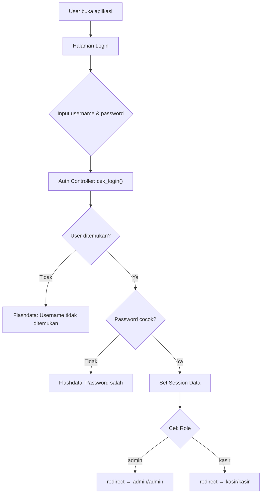
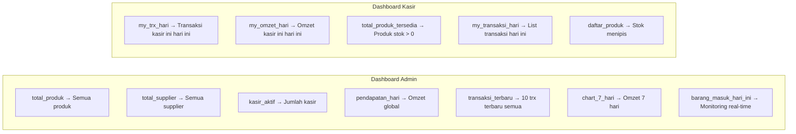
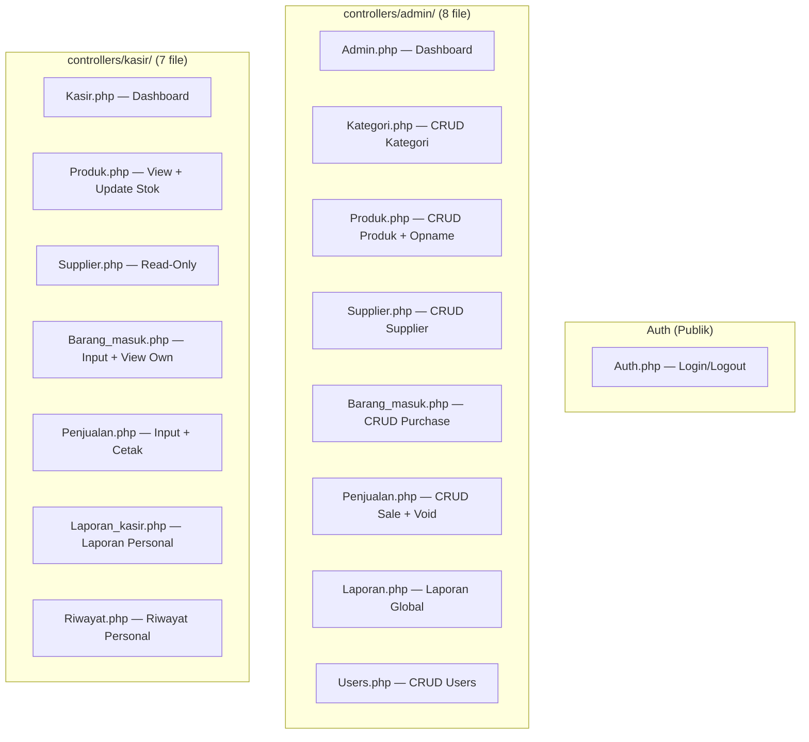

# Analisis Pembagian Hak Akses: Admin vs Kasir

Sistem **PT Pordjo** menggunakan **Role-Based Access Control (RBAC)** dengan dua peran: `admin` dan `kasir`.  
Dokumen ini merupakan analisis menyeluruh berdasarkan seluruh source code terkini.

---

## 1. Mekanisme Autentikasi

### 1.1 Proses Login



### 1.2 Data Session yang Disimpan

| Key Session | Isi | Kegunaan |
|---|---|---|
| `id_user` | ID unik dari tabel `users` | Identifikasi user, filter data personal |
| `username` | Nama login | Tampilan di header |
| `nama` | Nama lengkap | Tampilan di sidebar/navbar |
| `role` | `admin` atau `kasir` | Penentu hak akses utama |
| `logged_in` | `TRUE` | Guard: apakah sudah login |
| `login_time` | Waktu login (Y-m-d H:i) | Informasi sesi |

### 1.3 Session Guard (Penjagaan Akses)

Setiap controller memiliki **dua lapis guard** di `__construct()`:

```php
// Lapis 1: Wajib login
if (!$this->session->userdata('logged_in')) redirect('auth');

// Lapis 2: Wajib role yang sesuai
if ($this->session->userdata('role') !== 'admin') redirect('kasir');
```

**Perilaku redirect per-controller:**

| Controller Admin | Jika Bukan Admin → |
|---|---|
| [Admin.php](file:///c:/laragon/www/TA/application/controllers/admin/Admin.php) | `redirect('kasir')` |
| [Kategori.php](file:///c:/laragon/www/TA/application/controllers/admin/Kategori.php) | `redirect('kasir')` + flashdata error |
| [Produk.php](file:///c:/laragon/www/TA/application/controllers/admin/Produk.php) | `redirect('kasir/produk')` |
| [Supplier.php](file:///c:/laragon/www/TA/application/controllers/admin/Supplier.php) | `redirect('kasir')` + flashdata error |
| [Barang_masuk.php](file:///c:/laragon/www/TA/application/controllers/admin/Barang_masuk.php) | `redirect('kasir/barang_masuk')` |
| [Penjualan.php](file:///c:/laragon/www/TA/application/controllers/admin/Penjualan.php) | `redirect('kasir/penjualan')` |
| [Laporan.php](file:///c:/laragon/www/TA/application/controllers/admin/Laporan.php) | `redirect('kasir/kasir')` + flashdata error |
| [Users.php](file:///c:/laragon/www/TA/application/controllers/admin/Users.php) | `redirect('kasir')` + flashdata error |

| Controller Kasir | Jika Bukan Kasir → |
|---|---|
| [Kasir.php](file:///c:/laragon/www/TA/application/controllers/kasir/Kasir.php) | `redirect('admin')` |
| [Produk.php](file:///c:/laragon/www/TA/application/controllers/kasir/Produk.php) | `redirect('admin/produk')` |
| [Penjualan.php](file:///c:/laragon/www/TA/application/controllers/kasir/Penjualan.php) | `redirect('admin/penjualan')` |
| [Barang_masuk.php](file:///c:/laragon/www/TA/application/controllers/kasir/Barang_masuk.php) | `redirect('admin/barang_masuk')` |
| [Supplier.php](file:///c:/laragon/www/TA/application/controllers/kasir/Supplier.php) | `redirect('admin/supplier')` |
| [Laporan_kasir.php](file:///c:/laragon/www/TA/application/controllers/kasir/Laporan_kasir.php) | `redirect('admin/laporan')` |
| [Riwayat.php](file:///c:/laragon/www/TA/application/controllers/kasir/Riwayat.php) | `redirect('admin/penjualan')` |

---

## 2. Matriks Hak Akses Lengkap

### Legenda
| Simbol | Arti |
|:---:|---|
| ✅ | Akses penuh (CRUD) |
| 📝 | Bisa tambah & lihat, tapi tidak bisa hapus |
| 🔧 | Hanya operasi terbatas tertentu |
| 👁️ | Hanya melihat (Read-Only) |
| 🔒 | Akses terbatas ke data sendiri (Personal Scope) |
| ❌ | Tidak memiliki akses sama sekali |

### Tabel Perbandingan Detail

| Modul | Operasi | Admin | Kasir | Keterangan |
|---|---|:---:|:---:|---|
| | | | | |
| **Dashboard** | Lihat ringkasan | ✅ | 🔒 | Admin: data global seluruh sistem. Kasir: hanya statistik transaksi milik sendiri |
| | Chart penjualan 7 hari | ✅ | ❌ | |
| | Monitoring barang masuk hari ini | ✅ | ❌ | |
| | Info jumlah kasir aktif | ✅ | ❌ | |
| | Info jumlah supplier | ✅ | ❌ | |
| | Cek stok menipis | ✅ | ✅ | |
| | | | | |
| **Kategori Produk** | Lihat daftar | ✅ | ❌ | Kasir tidak punya controller/menu kategori |
| | Tambah kategori | ✅ | ❌ | |
| | Edit kategori | ✅ | ❌ | |
| | Hapus kategori | ✅ | ❌ | Dengan proteksi foreign key ke produk |
| | | | | |
| **Stok Produk** | Lihat semua produk | ✅ | ✅ | Keduanya bisa lihat + filter per kategori |
| | Tambah produk baru | ✅ | ❌ | |
| | Edit produk (nama/harga/satuan) | ✅ | ❌ | |
| | Update stok manual (opname) | ✅ | 🔧 | Keduanya bisa, **sudah dilengkapi audit trail ke tabel `stok_log`** |
| | Hapus produk | ✅ | ❌ | |
| | | | | |
| **Data Supplier** | Lihat daftar | ✅ | 👁️ | Kasir: `index()` read-only, tanpa tombol tambah/edit/hapus |
| | Tambah supplier | ✅ | ❌ | Dengan validasi form lengkap |
| | Edit supplier | ✅ | ❌ | Dengan validasi form lengkap |
| | Hapus supplier | ✅ | ❌ | |
| | | | | |
| **Barang Masuk** | Lihat history | ✅ | 🔒 | Admin: `get_all()` semua data. Kasir: `get_by_user()` **hanya data milik sendiri** |
| | Tambah transaksi | ✅ | 📝 | Keduanya bisa input barang masuk |
| | Lihat detail | ✅ | 🔒 | Kasir: **validasi kepemilikan** — hanya bisa lihat detail milik sendiri |
| | Hapus/void barang masuk | ✅ | ❌ | Admin only — stok otomatis dikurangi |
| | | | | |
| **Penjualan** | Lihat riwayat | ✅ | 🔒 | Admin: semua transaksi. Kasir: hanya hari ini + milik sendiri |
| | Buat transaksi baru | ✅ | ✅ | Dengan validasi stok real-time |
| | Lihat detail transaksi | ✅ | ✅ | |
| | Cetak nota/invoice | ✅ | ✅ | |
| | Void/batal transaksi | ✅ | ❌ | **Fitur kritis** — stok dikembalikan otomatis |
| | AJAX get produk JSON | ✅ | ✅ | Untuk pencarian produk real-time |
| | | | | |
| **Laporan Penjualan** | Lihat laporan | ✅ | 🔒 | Admin: laporan global semua kasir. Kasir: hanya data sendiri |
| | Preset filter tanggal | ✅ | 🔒 | Admin: 5 preset. Kasir: 3 preset |
| | Lihat chart omzet harian | ✅ | ❌ | |
| | Lihat performa per kasir | ✅ | ❌ | |
| | Lihat top produk | ✅ | 🔒 | Admin: top global. Kasir: top personal |
| | Cetak laporan | ✅ | 🔒 | Admin: cetak global. Kasir: cetak setoran pribadi |
| | | | | |
| **Riwayat Transaksi** | Lihat semua riwayat | ❌ | 🔒 | **Fitur eksklusif kasir** — semua riwayat milik sendiri |
| | | | | |
| **Kelola Akun** | Lihat semua user | ✅ | ❌ | |
| | Tambah user baru | ✅ | ❌ | Bisa buat admin/kasir baru |
| | Edit user | ✅ | ❌ | Termasuk ganti password & role |
| | Hapus user | ✅ | ❌ | Proteksi: tidak bisa hapus diri sendiri |

---

## 3. Perbedaan Scope Data

### 3.1 Dashboard



### 3.2 Penjualan — Query yang Digunakan

| Fitur | Admin (Query) | Kasir (Query) |
|---|---|---|
| List transaksi | `M_sale->get_all()` | `M_sale->get_today_by_kasir($id_user)` |
| Omzet hari ini | `M_sale->omzet_hari_ini()` | `M_sale->omzet_by_kasir_hari_ini($id_user)` |
| Jumlah transaksi | `M_sale->count_hari_ini()` | `M_sale->count_by_kasir_hari_ini($id_user)` |
| Void transaksi | `M_sale->void_transaksi($id)` | ❌ Tidak tersedia |

### 3.3 Barang Masuk — Query yang Digunakan

| Fitur | Admin (Query) | Kasir (Query) |
|---|---|---|
| List history | `M_purchase->get_all()` | `M_purchase->get_by_user($id_user)` |
| Detail | `M_purchase->get_by_id($id)` | `M_purchase->get_by_id($id)` + **cek kepemilikan** |
| Hapus transaksi | `M_purchase->hapus_transaksi($id)` | ❌ Tidak tersedia |

### 3.4 Laporan — Scope & Preset

| Aspek | Admin | Kasir |
|---|---|---|
| Query data | `get_laporan($awal, $akhir)` | `get_laporan_kasir($id, $awal, $akhir)` |
| Omzet | `omzet_by_range()` — global | `omzet_kasir_range($id)` — personal |
| Top produk | `get_top_produk()` — global 5 | `get_top_produk_kasir($id)` — personal 10 |
| Chart omzet | `omzet_per_day()` ✅ | ❌ |
| Per kasir | `omzet_per_kasir()` ✅ | ❌ |
| Preset filter | Hari ini, Minggu ini, Bulan ini, Bulan lalu, Tahun ini, Custom | Hari ini, Minggu ini, Bulan ini, Custom |

---

## 4. Navigasi Sidebar

### Admin Sidebar
```
📊 Dashboard
── Master Data ──────────────
📦 Data Material ▾
   ├─ Kategori Produk
   └─ Stok Produk
🚛 Data Supplier
── Transaksi ────────────────
⬇️ Barang Masuk
🛒 Penjualan Offline
── Pengaturan ───────────────
📄 Laporan Penjualan
👥 Kelola Akun
─────────────────────────────
🚪 Logout
```

### Kasir Sidebar
```
📊 Dashboard
── Master Data ──────────────
📦 Data Material ▾
   └─ Stok Produk
🚛 Data Supplier (read-only)
── Transaksi ────────────────
⬇️ Barang Masuk
🛒 Penjualan Offline
── Laporan ──────────────────
📄 Laporan Penjualan (personal)
🕐 Riwayat Transaksi
─────────────────────────────
🚪 Logout
```

**Perbedaan menu:**
- ❌ Kasir **tidak punya**: Kategori Produk, Kelola Akun
- ✅ Kasir **punya eksklusif**: Riwayat Transaksi

---

## 5. Pemetaan Route Lengkap

### Admin — 27 Route

| Grup | Route | Method |
|---|---|---|
| Dashboard | `admin/admin` | `index` |
| Kategori | `admin/kategori` | `index` |
| | `admin/kategori/tambah` | `tambah` |
| | `admin/kategori/update` | `update` |
| | `admin/kategori/hapus` | `hapus` |
| Produk | `admin/produk` | `index` |
| | `admin/produk/tambah` | `tambah` |
| | `admin/produk/update` | `update` |
| | `admin/produk/update_stok` | `update_stok` |
| | `admin/produk/hapus` | `hapus` |
| Supplier | `admin/supplier` | `index` |
| | `admin/supplier/tambah` | `tambah` |
| | `admin/supplier/update` | `update` |
| | `admin/supplier/hapus` | `hapus` |
| Users | `admin/users` | `index` |
| | `admin/users/tambah` | `tambah` |
| | `admin/users/update` | `update` |
| | `admin/users/hapus` | `hapus` |
| Barang Masuk | `admin/barang_masuk` | `index` |
| | `admin/barang_masuk/create` | `create` |
| | `admin/barang_masuk/simpan` | `simpan` |
| | `admin/barang_masuk/detail/(:num)` | `detail` |
| | `admin/barang_masuk/hapus` | `hapus` |
| Penjualan | `admin/penjualan` | `index` |
| | `admin/penjualan/create` | `create` |
| | `admin/penjualan/simpan` | `simpan` |
| | `admin/penjualan/detail/(:num)` | `detail` |
| | `admin/penjualan/cetak/(:num)` | `cetak` |
| | `admin/penjualan/void` | `void_transaksi` |
| | `admin/penjualan/get_produk` | `get_produk_json` |
| Laporan | `admin/laporan` | `index` |
| | `admin/laporan/cetak` | `cetak` |

### Kasir — 14 Route

| Grup | Route | Method |
|---|---|---|
| Dashboard | `kasir` / `kasir/kasir` | `index` |
| Produk | `kasir/produk` | `index` |
| | `kasir/produk/update_stok` | `update_stok` |
| Supplier | `kasir/supplier` | `index` (read-only) |
| Barang Masuk | `kasir/barang_masuk` | `index` (data personal) |
| | `kasir/barang_masuk/create` | `create` |
| | `kasir/barang_masuk/simpan` | `simpan` |
| | `kasir/barang_masuk/detail/(:num)` | `detail` (+ cek kepemilikan) |
| Penjualan | `kasir/penjualan` | `index` |
| | `kasir/penjualan/create` | `create` |
| | `kasir/penjualan/simpan` | `simpan` |
| | `kasir/penjualan/detail/(:num)` | `detail` |
| | `kasir/penjualan/cetak/(:num)` | `cetak` |
| | `kasir/penjualan/get_produk` | `get_produk_json` |
| Laporan | `kasir/laporan` | `index` (data personal) |
| | `kasir/laporan/cetak` | `cetak` (data personal) |
| Riwayat | `kasir/riwayat` | `index` |
| | `kasir/riwayat/detail/(:num)` | `detail` |

---

## 6. Fitur Keamanan yang Sudah Diterapkan

### 6.1 Audit Trail Perubahan Stok ✅
Setiap perubahan stok manual (opname) oleh admin maupun kasir dicatat ke tabel `stok_log`:

| Kolom | Isi |
|---|---|
| `id_product` | Produk yang diubah |
| `id_user` | Siapa yang mengubah |
| `stok_sebelum` | Nilai stok sebelum |
| `stok_sesudah` | Nilai stok sesudah |
| `selisih` | Selisih perubahan |
| `keterangan` | "Penyesuaian stok manual oleh Admin/Kasir" |
| `created_at` | Waktu perubahan |

### 6.2 Isolasi Data Barang Masuk Kasir ✅
- Kasir hanya melihat data barang masuk **milik sendiri** (`get_by_user($id_user)`)
- Halaman detail memiliki **validasi kepemilikan** — kasir tidak bisa mengakses detail milik user lain via URL langsung

### 6.3 Proteksi Stok Negatif ✅
Sebelum menyimpan penjualan, sistem mengecek stok real-time ke database. Jika stok kurang dari qty yang diminta, transaksi **seluruhnya dibatalkan**.

### 6.4 Proteksi Hapus Diri Sendiri ✅
Admin tidak bisa menghapus akun yang sedang digunakan (`id_user == session id_user` → ditolak).

### 6.5 Proteksi Foreign Key Kategori ✅
Admin tidak bisa menghapus kategori jika masih ada produk yang menggunakan kategori tersebut.

### 6.6 Proteksi Duplikasi Faktur ✅
Sistem mencegah input faktur barang masuk dengan nomor yang sudah terdaftar (`faktur_exists()`).

---

## 7. Ringkasan Visual

```
┌──────────────────────────────────────────────────────────────┐
│                    ADMIN (Superuser)                         │
│                                                              │
│  ✅ Full CRUD Kategori Produk                                │
│  ✅ Full CRUD Produk (tambah/edit/hapus/opname + audit log)  │
│  ✅ Full CRUD Supplier (dengan validasi form lengkap)        │
│  ✅ Full CRUD Users / Kelola Akun                            │
│  ✅ Full CRUD Barang Masuk (input/detail/hapus+restock)      │
│  ✅ Full CRUD Penjualan (input/detail/cetak/void+restock)    │
│  ✅ Laporan Global (semua kasir, chart, analytics, cetak)    │
│  ✅ Dashboard Global (overview seluruh sistem)               │
│                                                              │
│  Scope Data: GLOBAL — melihat semua data dari semua user     │
└──────────────────────────────────────────────────────────────┘

┌──────────────────────────────────────────────────────────────┐
│                    KASIR (Operator)                          │
│                                                              │
│  ❌ Kategori — Tidak ada akses                               │
│  🔧 Produk — Lihat + update stok saja (dengan audit log)    │
│  👁️ Supplier — Read-only (hanya melihat)                     │
│  ❌ Kelola Akun — Tidak ada akses                            │
│  📝 Barang Masuk — Input + lihat milik sendiri (tanpa hapus) │
│  📝 Penjualan — Input + cetak (tanpa void/batal)             │
│  🔒 Laporan — Hanya data penjualan sendiri                   │
│  🔒 Dashboard — Statistik personal hari ini                  │
│  ✅ Riwayat Transaksi — Fitur eksklusif kasir               │
│                                                              │
│  Scope Data: PERSONAL — hanya data milik sendiri (id_user)   │
└──────────────────────────────────────────────────────────────┘
```

---

## 8. Arsitektur File Controller & Model

### Controller



### Model (Shared — dipakai bersama)

Semua model terletak di `models/admin/` dan **dipakai oleh kedua role**:

| Model | Tabel Database | Digunakan Oleh |
|---|---|---|
| `M_auth.php` | `users` | Auth Controller |
| `M_produk.php` | `products` + `categories` + `stok_log` | Admin Produk, Kasir Produk, Dashboard |
| `M_kategori.php` | `categories` | Admin Kategori, Produk |
| `M_supplier.php` | `suppliers` | Admin Supplier, Kasir Supplier, Barang Masuk |
| `M_purchase.php` | `purchases` + `purchase_details` | Admin Barang Masuk, Kasir Barang Masuk |
| `M_sale.php` | `sales` + `sale_details` | Admin Penjualan, Kasir Penjualan, Laporan, Dashboard |
| `M_users.php` | `users` | Admin Users, Dashboard |

> [!IMPORTANT]
> Model tidak melakukan validasi role — keamanan sepenuhnya bergantung pada **guard di controller**. Controller yang menentukan method model mana yang dipanggil (misalnya `get_all()` vs `get_by_user()`).
